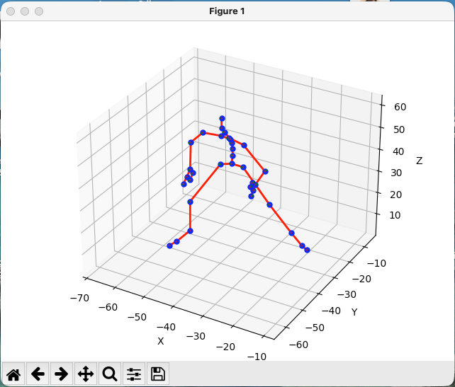

# Instructions  
 
## Env Set up
 ```
uv venv --python 3.12.13
source .venv/bin/activate
uv sync
 ```

You will have to install Autodesk FBX SDK Python bindings for your Python version (3.12.13) and OS.
Download Python SDK version 2020.2.1 from here: https://aps.autodesk.com/developer/overview/fbx-sdk

Add it to your python path
```export PYTHONPATH="/Applications/Autodesk/FBX Python SDK/2020.2.1/lib/Python37_x64:$PYTHONPATH"```

## How to run `fbx_importer.py` from root
 ```
 uv run python ase/poselib/fbx_importer.py
 ```

# FAQ: 

## Pressing h/n doesn't do any thing. 
Fix: Make sure the `matplotlib` window is active. h/n are not terminal inputs.


 ## Attribution
 The code in this repo builds on the code accompanying this paper: Strategy and Skill Learning for Physics-based Table Tennis Animation (https://arxiv.org/abs/2407.16210)